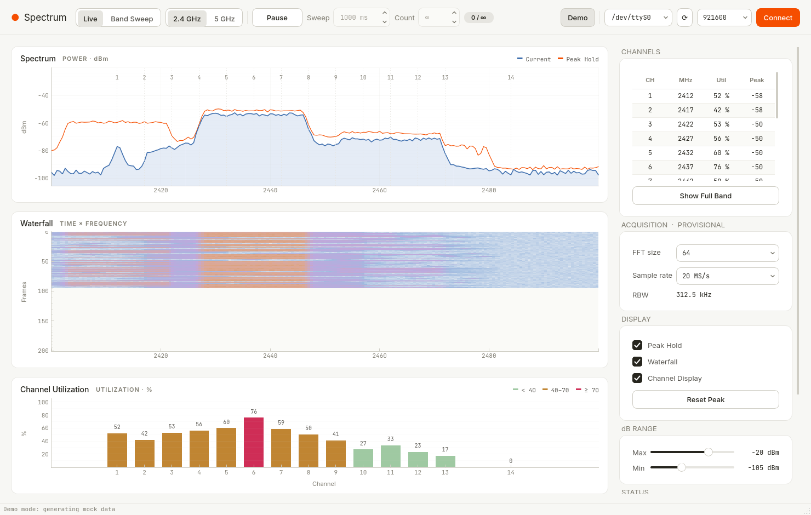
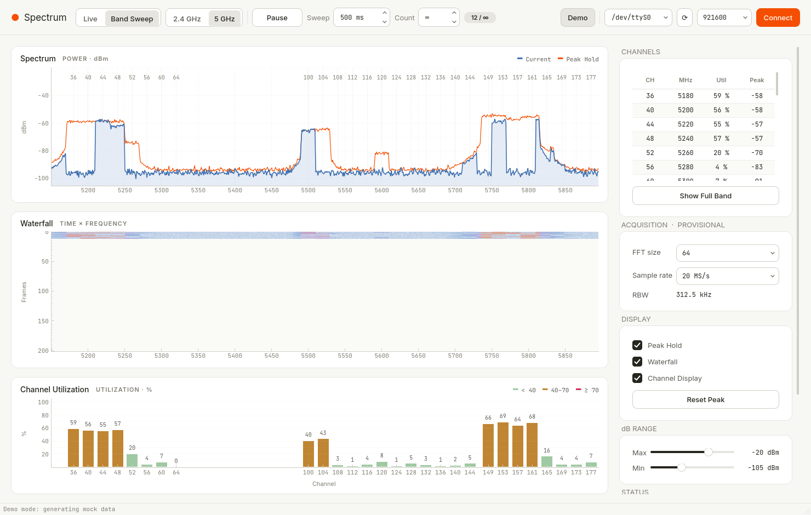

# ESP32-C5 Wi-Fi Spectrum Monitor

ESP32-C5 firmware and a desktop GUI (PySide6 + pyqtgraph) for dual-band
(2.4 / 5 GHz) Wi-Fi monitoring. The real device captures raw I/Q snapshots,
computes FFT power, and sends it over the board's USB-UART bridge using
CRC32-protected TLV frames. Real spectra use relative **dBFS**, not calibrated
antenna-input dBm. Packet RSSI and AP sightings are separate protocol observations.
Real and **Demo (mock)** sources use the same spectrum, peak-hold, waterfall
and channel-utilization view. Real utilization is an experimental sampled PHY
CCA counter ratio from configurable distributed windows per dwell (1–32 attempts,
default 16). The display can pool recent channel visits (default four), with the
latest raw ratio, counter sums, valid/attempted counts and window-time bounds
exposed separately in tooltips. It is not a whole-dwell average or established MAC/NAV airtime;
invalid samples remain unavailable rather than becoming invented percentages.
Each RF snapshot has its complex I/Q mean removed before windowing and FFT to
suppress the receiver's center-frequency DC component. This also suppresses a
genuine signal component exactly at the tuned center; see the measurement limits
in the TLV contract.
The screenshots below show synthetic Demo data, not measured RF spectra.

- [Firmware build and verification](docs/firmware.md): ESP-IDF v6.0.3 through EIM, Podman or Windows wslc.
- [Real monitor events and measurement semantics](docs/wifi-monitor.md).
- [TLV framing, CRC32 and CONFIG](docs/tlv-protocol.md).

The [firmware workflow](docs/firmware.md#hardware-verification) records
revision-specific EIM/Podman builds, USB-UART programming, both-band Live/Sweep
checks and physical-device GUI tests on Linux (offscreen), including failures
and transport limitations. Earlier images' long-run results do not verify later
changes. Windows validation is performed separately; Linux tests do not establish
Windows operation or calibrated RF accuracy.




**Design:** the UI follows [`DESIGN.md`](DESIGN.md) (Cursor design system): warm-cream
canvas `#f7f7f4`, warm ink `#26251e`, white hairline cards with no shadows, Cursor Orange
`#f54e00` only on the primary CTAs (▶ Start / Connect), quiet hairline segmented controls,
Inter for UI text and JetBrains Mono for every numeric surface (MHz, dBm, COM, baud,
channel table). Plot accents use the DESIGN.md pastels (blue spectrum, orange peak hold,
blue→lavender→peach→gold waterfall, mint/gold/error utilization bars). All tokens live in
`wifi_spectrum/theme.py`. (Earlier dark-theme screenshots: `docs/screenshot_24_live.png`,
`docs/screenshot_5_sweep.png`.)

## Run

The project is managed with [uv](https://docs.astral.sh/uv/). Dependencies live in
`pyproject.toml`, exact versions are pinned in `uv.lock` (commit both).

From the repository directory, PowerShell, Command Prompt, and Unix shells use the same commands:

```bash
uv sync                                # creates .venv and installs locked deps + the package
uv run wifi-spectrum --demo            # start in demo mode (omit --demo for normal start)
# or: uv run python -m wifi_spectrum --demo
```

`uv run` uses the project environment, so `.venv` does not have to be on `PATH`.
Requires Python ≥ 3.10; uv downloads a suitable interpreter automatically if none is found.

Install uv if needed:

```bash
curl -LsSf https://astral.sh/uv/install.sh | sh
```

```powershell
powershell -ExecutionPolicy ByPass -c "irm https://astral.sh/uv/install.ps1 | iex"
```

Open a new terminal if `uv` is not recognized after install. PowerShell execution policy does not affect `uv sync` or `uv run`.

### Windows

```powershell
cd path\to\wlan-spectrum
uv sync
uv run wifi-spectrum --demo
```

* **Demo** is the hardware-free path on Windows. It does not open a serial port. The **Demo** button in the window does the same thing.
* Connect the board's **USB-UART** port (CP2102N on the tested board). It appears as `COM3`, `COM4`, … under **Ports (COM & LPT)** in Device Manager. The native USB-JTAG port does not carry this firmware's data stream.
* In the GUI, press refresh, pick that `COMx` name (or type it), set baud to **921600**, and press **Connect**. `COM10` and above are listed in numeric order and opened as `COMx`.

### Linux

Qt needs some system libs, e.g.
`sudo apt install libegl1 libxkbcommon-x11-0 libxcb-cursor0`. For serial access add your
user to the `dialout` group. Headless (no display): `QT_QPA_PLATFORM=offscreen`.
The tested CP2102N bridge appears as `/dev/ttyUSB0`; prefer its stable
`/dev/serial/by-id/` path for scripts. Use **921600 baud**.

The UI is in English. Inter and JetBrains Mono are used when installed; otherwise Qt falls back to the system sans / monospace (Consolas and Yu Gothic UI are in the Windows fallback list).

Click **Demo** to fill all three graphs with generated data, or pick a COM
port, baud rate and press **Connect** for a real device.

### Build a wheel / sdist

```bash
uv build            # → dist/wifi_spectrum_gui-0.1.0-py3-none-any.whl and dist/wifi_spectrum_gui-0.1.0.tar.gz
```

The wheel includes `wifi_spectrum/assets/*.svg` and installs the `wifi-spectrum` command
(e.g. `uv tool install dist/wifi_spectrum_gui-0.1.0-py3-none-any.whl`, or `pip install` it).

### End-to-end serial test without hardware

`--pty` opens a POSIX pseudo-terminal. It runs on Linux and macOS. On Windows the same command exits with a short message and does not open a port.

```bash
uv run python -m wifi_spectrum.mock --pty   # prints e.g. "Fake ESP32-C5 on /dev/pts/3"
uv run wifi-spectrum                        # in another terminal: type /dev/pts/3 in the COM box → Connect
```

On Windows, use demo mode instead (`uv run wifi-spectrum --demo`, or the **Demo** button). That feeds the same mock TLV stream into the GUI in-process. This repo does not set up a virtual COM pair.

## UI

Real RF and Demo share the following layout. Real RF uses dBFS, advertises
supported FFT sizes/sample rates, and shows sampled PHY CCA percentages where
valid. Missing utilization remains `—`.
Live updates each channel snapshot; Sweep publishes at the explicit device
cycle marker. Missing capture regions are gaps rather than a generated floor.

| Area | Contents |
|---|---|
| Top bar | Live / Band Sweep segmented control, 2.4 GHz / 5 GHz, ▶ Start / Pause, Sweep time (ms), Count (0 = ∞) + progress, Demo, COM port / ⟳ / baud / Connect |
| Left (shared X axis, MHz) | 1. Spectrum — blue current + orange peak hold (real dBFS / Demo dBm), channel markers, hover readout · 2. Waterfall (blue→lavender→peach→gold map, newest row on top) · 3. Channel Utilization (generated % in Demo; experimental sampled PHY CCA % on the real device) |
| Right panel | Channels (CH / MHz / Util / Peak; click a row to zoom), Show Full Band, FFT size & Sample rate (real acquisition settings; nominal bin spacing shown as RBW), Peak Hold / Waterfall / Channel Display toggles, Reset Peak, dB Range sliders, Status (link, bytes, fps, TLV errors, device capabilities and drops) |

Mouse wheel / drag zooms and pans the frequency axis on all three plots together.

### Measurement and display settings

Measurement settings change device acquisition; display settings do not send CONFIG.

| Setting | Range / default | Meaning |
|---|---|---|
| Channel dwell | Auto, or 120–2000 ms; default Auto | Requested receive time per channel; the effective target also reserves 5 ms per CCA attempt |
| CCA attempts | 1–32; default 16 | Target short PHY-counter windows distributed across a dwell; invalid or missed windows are reported, not invented |
| Display refresh | 5–60 FPS; default 30 | Repaint rate, not the measurement or serial receive rate |
| Waterfall history | 50–1000 rows; default 200 | Retained display history |
| Utilization visits | 1–16; default 4 | Counter-weighted aggregation of recent valid visits per channel; 1 shows the latest raw result |

Live retains the last result for other channels while the next scan visits them.
Invalid measurements and channels missing from a completed cycle remain unavailable,
not zero. Sweep publishes a completed cycle together. Tooltips distinguish the
latest raw measurement from the displayed aggregate and its contributing visits.
Longer averaging can make the display steadier; it does not improve RF calibration
or turn intermittent samples into continuous channel coverage.

Click **Apply** to send the selected dwell and CCA-attempt settings. Changes to
FFT size, sample rate and Sweep time are sent after a short editing pause;
each request includes all seven selected acquisition fields.
Display refresh, history and aggregation changes take effect locally without CONFIG.
Resizing history preserves the newest rows that fit and does not reset other measurements.

Mode, band, Sweep time, FFT size, sample rate, dwell, CCA attempts and the three
display settings are saved locally. Port names, USB identifiers and automatic
connection/start are not saved. **Reset defaults** restores the saved selections;
use **Apply** to send them to a connected device.
The effective dwell and measured cycle time are read back separately: the requested
Sweep time is not a guaranteed wall-clock cycle period.

## TLV protocol

Every frame: `type u8 | length u16 LE | payload[length] | crc32 u32 LE`.
CRC-32/ISO-HDLC covers the exact header and payload; length excludes the
header and checksum. Both directions require it, with no CRC-less fallback.
Field layouts, resync rules, and byte examples: [`docs/tlv-protocol.md`](docs/tlv-protocol.md).

| Type | Dir | Payload |
|---|---|---|
| `0x01` SPECTRUM | Demo→PC | `f_start_mhz f32, f_step_mhz f32, n u16, n × int16 (dBm×100)` |
| `0x02` CH_UTIL | Demo→PC | `band u8 (0=2.4, 1=5), n u8, n × (ch u8, util_pct u8)` |
| `0x03` STATUS | dev→PC | Real firmware: `wifi-monitor/1` JSON events. Codec also supports Demo JSON and binary status. |
| `0x04` SPECTRUM_RF | dev→PC | Epoch/cycle, band/channel/mode, rate code, FFT size/source, center/span in kHz, then int16 dBFS×100 bins |
| `0x10` CONFIG | PC→dev | `mode u8 (0=live,1=sweep), band u8, sweep_ms u16, fft_size u16, sample_rate_khz u32, channel_dwell_ms u16, cca_attempts u8` |

* Demo spectrum frames may cover the whole band (live) or a segment (sweep); the GUI
  resamples them onto its display grid (2.4 GHz: 2400–2500 MHz @ 0.5 MHz,
  5 GHz: 5150–5895 MHz @ 1 MHz).
* In Demo band-sweep mode a sweep is counted complete when a segment reaching the top
  of the band arrives; then a waterfall row is added.
* CONFIG has one current 13-byte version-1 payload. Update firmware and GUI
  together; the earlier 10-byte payload is rejected, with no compatibility branch.
* Real monitoring uses explicit configuration epochs and cycle events, not the
  Demo frequency heuristic. Packet rate is not a utilization percentage.

## Publication privacy

Keep device serials, MAC addresses, USB inventories/registry exports, personal
paths and real captures out of source, documentation and screenshots. Supply
`PORT` and `JTAG_SERIAL` locally; the Make targets refuse an unspecified device.
Set `IDF_PATH` locally for optional SDK-header checks in native tests.
Store local evidence under an ignored directory such as `.local/` or `captures/`.

Before committing, run `python3 scripts/check_public_files.py`. To enable the
staged-file check locally, run `git config --local core.hooksPath .githooks`
(integrate with an existing hook instead of replacing it). GitHub Actions also
checks the committed snapshot. The check reports paths and rule names, not the
matched values. It detects common machine identifiers; it is not a comprehensive
secret scanner and does not inspect image pixels. Review screenshots manually
and use synthetic Demo data for public examples.

Deleting a published value in a later commit does not remove it from Git
history. History cleanup requires coordinated rewriting and updating other
clones; cached GitHub views or third-party copies can remain accessible.

## Files

```
wifi_spectrum/
  __main__.py     entry point (wifi-spectrum / python -m wifi_spectrum [--demo])
  main_window.py  window, plot cards, panels, segmented controls
  monitor_data.py real-device event validation, epoch/cycle and AP state
  theme.py        DESIGN.md tokens, Qt stylesheet, plot styling, colormaps
  assets/         small SVG glyphs (checkbox tick, chevrons) used by the stylesheet
  tlv.py          TLV encode/decode + incremental stream parser
  serial_link.py  QThread serial reader (pyserial) → Qt signals; port listing
  mock.py         fake device (TLV bytes); demo mode on every OS, --pty on Linux/macOS
  bands.py        2.4/5 GHz band ranges and channel tables
```

## Limitations / TODO

* Every frame has CRC32 but no sync word. Plausible false headers can delay
  recovery until more bytes arrive; byte-bounded buffering does not guarantee
  recovery within a fixed time on a stopped stream.
* Raw I/Q capture uses a private PHY entry point pinned to ESP-IDF v6.0.3.
  It is a sequence of snapshots, not continuous whole-band acquisition.
  dBFS is not calibrated dBm; gain, frequency response and absolute RF accuracy
  are unqualified. CCA is an experimental sampled estimate, not calibrated
  whole-dwell or MAC/NAV airtime.
* Mock data is synthetic (OFDM-like masks, duty-cycled APs, BT hops, microwave
  hump), not a model of real ESP32-C5 CSI/RSSI measurements.
* The real JP receive allowlist differs from the Demo grid; see the monitor
  contract. There is no active DFS radar detection or 6 GHz support.
* Pause drops incoming frames (the device keeps streaming).
* `--pty` is Linux/macOS only. Windows hardware-free runs use Demo mode.
